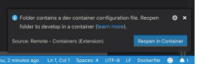
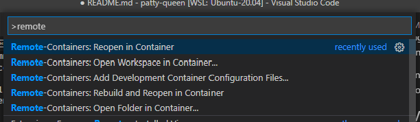
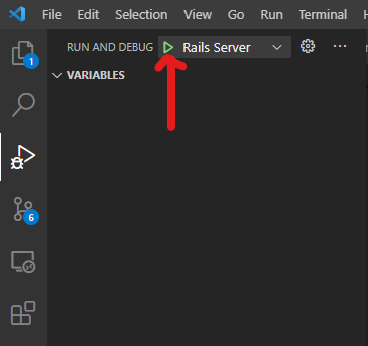

# Development Environment 

There are a few different ways to set up your environment:

1. Using Docker + VS Code + Remote Container extension
2. Using Docker Compose via command line
3. CreateNextApp directly via command line

Notes if using Docker (options 1 or 2): 

- You will need to have Docker already installed on your local machine. If you don't already have it installed, please use option 3 - it isn't necessary to learn a new tool (although it's very handy) for this exercise.

### Using Docker + VSCode + Remote Container extension

Open the root of this project in VS Code. If it is not already installed, you will be prompted to install the [Remote-Containers](https://marketplace.visualstudio.com/items?itemName=ms-vscode-remote.remote-containers) extension.

Once installed, VS Code will recognize a dev container configuration (in `./.devcontainer`) and ask to open the project in a container (which you should do!):

You can also open the command pallete (`CMD/CTRL + SHIFT + P`) and select `Remote-Containers: Reopen in Container`

After opening the project in a container you can access a shell inside the running Docker container (with `node` and `yarn` installed) using the built-in Terminal.

#### Install npm modules

Open a new Terminal in VS Code and run:

    yarn install

#### Starting the Next server

To run the Next server, use the `Run and Debug` panel on the left and click the green play button (or use `Run > Start Deugging` or `F5`) to start the Next app with the built-in debugger. You should now be able to set breakpoints and debug from inside of VS Code.

Any expected output from `server.js` will be in the `Debug Console` tab at the bottom, near `Terminal`

You should now be able to access the Next server at `http://localhost:3001`.

### Using Docker Compose via command line

To run the main Node application container (`app`) 

    docker-compose up

You can also run the container in the background using 

    docker-compose up -d 

And view logs for each container in a separate shell using `docker-compose logs`. For example:

    # Use the -f flag to tail the logs
    docker-compose logs -f app

To start a bash session inside the running Node app container run:

    docker-compose exec app /bin/bash

Here you should have access to `node` and `yarn`.

---

You should now be able to access the Next server at `http://localhost:3001`.

### Running everything directly via command line

Ensure you have Node 14.16.1 or higher installed. (Other versions may work, however this has only been tested on 14.16.1).

Next, install all npm modules:

    yarn install

#### Starting the Next server

    yarn dev

You should now be able to access the Next server at `http://localhost:3001`.

## Notes 

- This project was boostrapped using [Create Next App](https://github.com/vercel/next.js/tree/canary/packages/create-next-app). See [CREATE_NEXT_APP_README.md](CREATE_NEXT_APP_README.md) for more info on some of the scaffolding.
- This is meant to (hopefully) keep the amount of set up and configuration needed to start on the assignment to a minimum. Feel free to add any gems, npm packages or other tools that will be helpful!
- We are always improving our projects, so please share any feedback or suggestions on your experience.
